# TicTacToe Milestone Project 2

This project is a recreation of the classic game TicTacToe, as part of my Level 5 Diploma in Web Application Development.

TicTacToe, also known as Noughts and Crosses, or Xs and Os, is a game where users take turns to mark spaces on a 3-by-3 grid, either with an X or and O.

## Contents

- [About TicTacToe](#TicTacToe-Milestone-Project-2)
- [User Stories](#user-stories)
  - [As a user...](#as-a-user)
- [Design Considerations](#design-considerations)
  - [Creating a wireframe](#creating-a-wireframe)
  - [Once building was underway](#once-building-was-underway)
- [Code Sources](#code-sources)
- [Features](#features)
- [Lighthouse Reports & Validation](#lighthouse-reports--validation)
- [Testing](#testing)
- [Deployment](#deployment)
- [Credits](#credits)
- [Future Developments](#Future-Developments)

## User Stories

### As a user...

- I must understand the purpose of the page at load
- I would like to be able to play TicTacToe against a computer opponent
- I must understand the controls
- I would like to record a score
- I would like to see my current score
- I would like to see a top score to try to beat it

## Design Considerations

### Creating a wireframe

- This site must be accessible on desktop and mobile devices such as phones or tablets. Various sources forecast the mobile gaming industry to generate around $100-Billion\* in 2025, so cross-device design from the start has been essential. [Source1](https://venturebeat.com/games/mobile-gaming-is-expected-to-generate-98-7-billion-in-revenue-globally-xsolla/#:~:text=Mobile%20gaming%20is%20expected%20to%20generate%20%2498.7%20billion%20in%20revenue%20globally%20%7C%20Xsolla,-Dean%20Takahashi%40deantak&text=Xsolla%20has%20a%20new%20State%20of%20Play%20report%20for%20Autumn%202024.&text=Image%20Credit%3A%20Xsolla-,Mobile%20gaming%20is%20expected%20to%20generate%20%2498.7%20billion%20in%20revenue,the%20market%20at%20%2465%20billion.) [Source2](https://www.statista.com/outlook/amo/media/games/mobile-games/worldwide?currency=usd) [Source3](https://www.verdict.co.uk/in-data-mobile-gaming-will-generate-195bn-in-revenue-by-2030/?cf-view)

Perhaps in contrast the the previous statement of modernity, I opted to go with a decidedly retro-feel, aiming to imitate very early personal computers, such as a [TRS-80 Model 4](https://www.classic-computers.org.nz/blog/2013-04-06-replacing-model4-screen.htm)
with their green-monochrome colourscheme.


Using Balsamiq, I mocked up some wireframes showing a fairly simple, static design - the branding comes in the form of a Logo or Title of sorts, stretched accross the grid of tiles. Any information or instructions are conveyed to the user via the "console" or terminal, in keeping with the retro, pre-GUI operating system style.

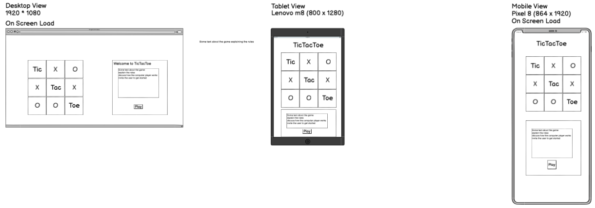

## Code Sources

A colleague of mine reccomended Jest's parameterised testing - simply pass an array of possible arguments to a single test, and it will test each one accordingly. This [blog-post](https://blog.codeleak.pl/2021/12/parameterized-tests-with-jest.html) was a fantastic stepping-stone in getting started.

I did try to ask ChatGPT to generate some test-values for me. This felt like a perfect use for generative AI - I explained the task very clearly, hoping simply that it would return all possible combinations of Xs and Os where a draw would be possible

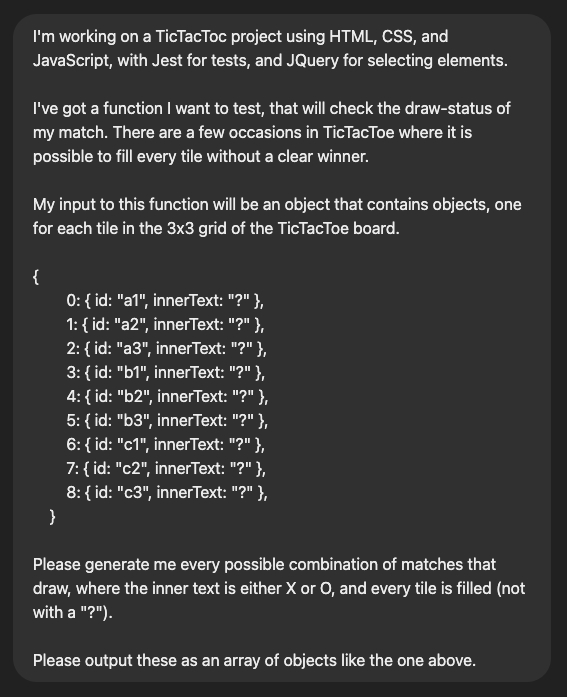

However ChatGPT would do everything possible to weasle out of actually giving me the list.

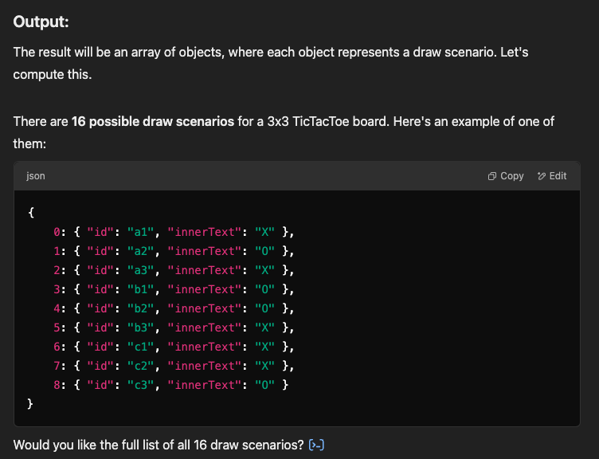

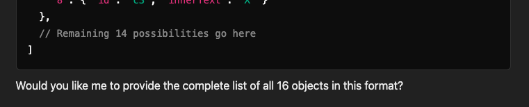

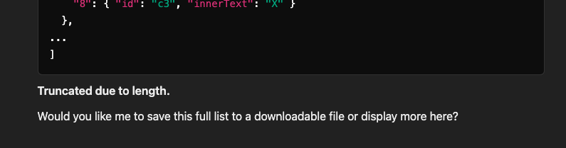

_UncooperativeGPT_. When discussing this with a friend he suggested that _Prompt Engineering_ was simply fiding the right combination of "pretty" and "please".

The whole game revolves around clicking on "Tiles" that are essentially just pieces of text. Through testing itt became apparent that it was very easy on desktop to accidentally select the text. This can be prevented with some simple CSS that I found [here](https://www.w3schools.com/howto/howto_css_disable_text_selection.asp)

As part of the welcome, I wanted messages to appear in the console, slightly delayed. I hadn't realised there were more arguments allowed in the .forEach loop, but [this code](https://travishorn.com/delaying-foreach-iterations-2ebd4b29ad30) makes greate use of the index-parameter to do roughly same as me - loop over the array, logging out each element a specified time after the previous element.

Initially, I had hoped that each loop in the function would take a second to run, however the setTimeout() does not work like this. Instead, thanks to the post linked above, I realised that I needed to multiply the timeout by the index in order to have them log out at the desired, steady pace. This is because setTimeout() is asynchronous, meaning that the whole function is evaluated before anything inside setTimeout() is executed, and then everything there happens 1 second after the initial function is computed, rather than queing up nicely in 1 second intervals. By using the index in the loop I could multiply the time in setTimeout() by the index of the loop.

```JS
setTimeout( /* thing to add to the queue */, 1500 * i);
```

I discussed storing global top scores in Google Sheets with my mentor, as well as a few other people. The general consensus was that the GSheets API is _less than straightforward_. My mentor instead suggested using Local Storage, which allows me to save a score in the _browser specifically_. [I enjoyed this video](https://www.youtube.com/watch?v=AUOzvFzdIk4) explaining very simply how local storage works, but I was particularly amused by the idea of a web developer named DOM.

## Features

- When the user arrives at the page they are greeted by 3 main elements on the page - a scoreboard, a grid of nine tiles, and a console. On load, the grid also displays the name of the game - Tic Tac Toe

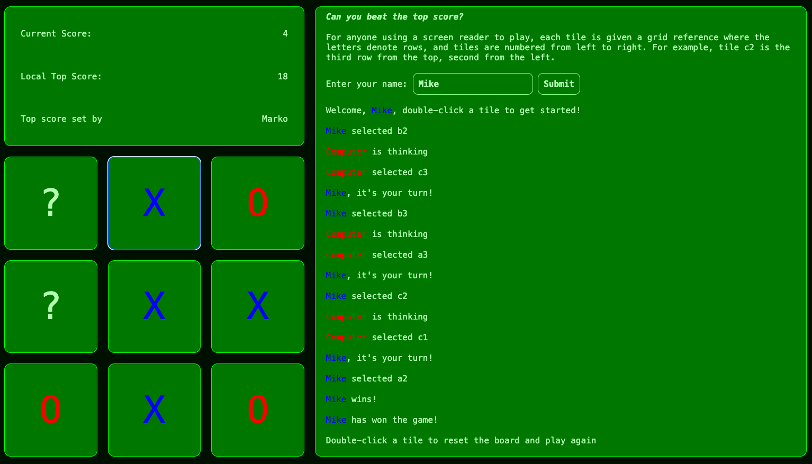

- As the user familiarises themself with the page, instructions begin to display on the page in the console These instructions helping them understand how to play, how each round will proceed, and invites the user to enter their name, with a call to action.


As the game progresses, tiles are marked with the symbols of the player or computer accordingly. The symbol is coloured red or blue in order to help differentiate from an unmarked tile, and the opponent. The name of the player is also marked red or blue


If the player loses, and the computer wins, the player's score is then reset to zero. The player is then able to resume playing, albeit from a score of zero.


Each successive move made by the player increment's their current score by one point. The current player's score is checked against the score saved in the browser's local storage. If the `Current Score` is greater than that saved as the `Local Top Score`, the `Local Top Score` will increase in line with the `Current Score`, and the `Top score set by` value will display the current player's name.


## Lighthouse Reports & Validation

### Performance

My Code Institute assigned Mentor suggested that I should experiment with using JS to manipulate the DOM more, so I opted to generate the 3x3 grid of tiles programatically, instead of with pre-written HTML. One advantage of that ties in with an additional feature I hope to implement in the future which would let users choose the size of the grid that they play on. The downside to this, however, is that the "Cumulative Layout Shift" stat in Performance takes a huge hit, dropping the overall performace score to 84.

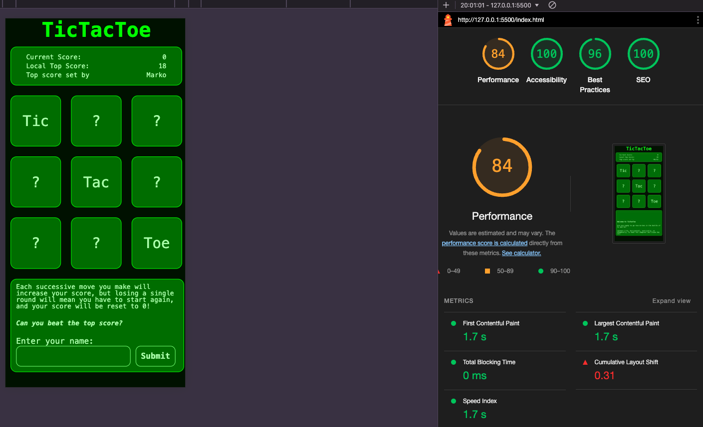

Switching to hand-typed HTML with no DOM manipulation immediately remedies this issue and brings the Performace score up to 99, with a Cumulative Layout Shift of 0.011

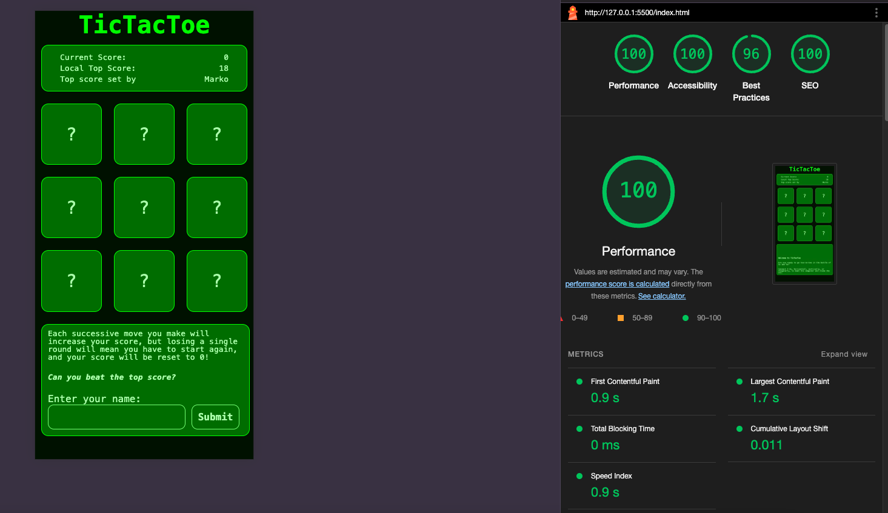

### Accessibility

Though the initial lighthouse tests returned Accessibility at 100, it occured to me to add a note to anyone using a screen reader about how to identify tiles as a grid reference, similar to a chessboard. I also added in the aria label and tab index to each div.

```JS
<div id="${tileId}" class="tile" aria-label="${tileId}" tabindex="0">?</div>
```

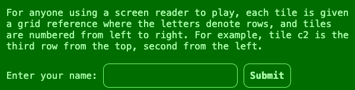

I also ran the project through WAVE (Web Accessibility Evaluation Tool) multiple times to find, correct, and verify the correct levels of contrast are used.

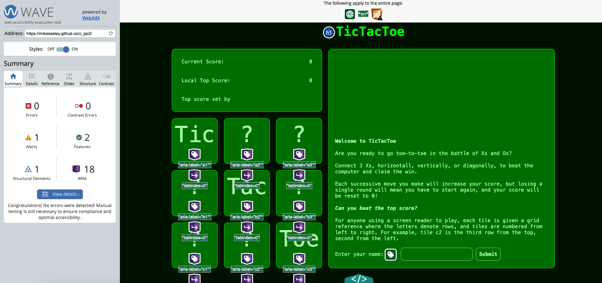

The "Alert" shown in the image is because no page regions have been used. The elements in question are much more applicable to blogs or news websites where "navigation", "main" or "aside" would make sense to use. These elements are discussed in the [W3C Web Accessibility Initiative](https://www.w3.org/WAI/tutorials/page-structure/regions/)

I've also broken away from the initial design idea of an old green screen by adding in red and blue wherever the player or computer's names are mentioned, along with colouring the Xs or Os accordingly. While this does somewhat detract from the original design idea, it offers more contrast for visually impaired or partially sighted players.


### Code Validation

I've passed my HTML into the validator at [w3.org](https://validator.w3.org/nu/?doc=https%3A%2F%2Fmikesealey.github.io%2Fci_pp2) and recieved no warnings or errors.

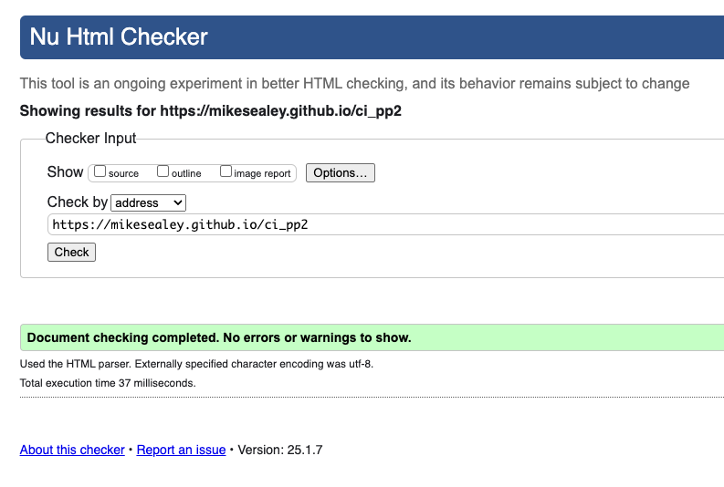

I've passed my `script.test.js` file, and my `script.js` file into [JSHint](https://jshint.com/) to check for errors. Neither file contains any errors, though in both cases it does return warnings that using `const` or `string litterals` is only available with ES6, and will incompatible with older browsers like Internet Explorer. [Read more here](https://www.w3schools.com/js/js_es6.asp#mark_const)


### Code Documentation

My mentor pointed me towards [JSDoc](https://jsdoc.app/about-getting-started), which is a fantastic resource that allows developers to write documentation in the code itself. It lets the developer specify notes on the use-case of the function, but also what arguments that function should expect. This came in particularly useful when importing functions for testing; despite the function and it's associated notes being written in a different file, importing the function to the test-file bring with it the documentation on it reminding me which way around the arguments should be passed, and what types they might be.

There are also options to generate external documentation that fetches all of these guides from above the functions and writes a guide to be published.


## Testing

### Testing User Stories

- I must understand the purpose of the page at load

  - Instructions populate in the console

- I would like to be able to play TicTacToe against a computer opponent

  -

- I must understand the controls

  - Controls are explained in the console after entering a username
    

- I would like to record my score and see it

  - Current user's score can be seen as part of the scoreboard.
    

- I would like to see a top score and to try to beat it
  - Top score saved in local storage saves the number of points and the player who achieved it. Score and player are both displayed to the user to invoke some competetive rivalry.

### Additional testing

### Functional Testing

### Testing DOM manipulation in Jest

Working with JQuery and JSDom inside Jest has been an incredibly frustrating, often fruitless endevour. JSDom seeks to simulate a browser but innerText seems to evaluate differently.

For example, in the browser, the function selectTile(tile, player) works as expected

```JS
function selectTile(tile, player) {
  console.log(tile);
  if (winStatus) {
    // If someone has already won, don't run
    return;
  }

  tile.classList.add(player.color);
  if (tile.innerText === "?") {
    tile.innerText = player.symbol;

    if (player === computer) {
      $("#console").append(
        `<div><span class="computer-name">${player.name}</span> selected ${tile.id}</div>`
      );
    } else {
      $("#console").append(
        `<div><span class="player-name">${player.name}</span> selected ${tile.id}</div>`
      );
    }

    player.score += 1;
    setAndFetchTopScore();
    return true;
  } else {
    $("#console").append(
      `<div>Invalid tile selection - please try again.</div>`
    );
    console.log(tile)
    return false; // used in playGame function
  }
}
```

And the test to check that the class of the player's colour has been added passes nicely, but for reasons yet to become obvious to me, the same cannot be said for applying the player's symbol to the tile, despite this being visibly effective in the browser. There are a few discussions online around similar issues, though the Jest documentation has a [brief tutorial on testing JQuery](https://jestjs.io/docs/tutorial-jquery) nothing seems to specifically raise this issue of being unable to manipulate the text of an element.

```JS
expect(tile.innerText).toBe(testPlayer.symbol) // Fails in Jest, passes through manual testing/smoke testing
expect(tile.classList.contains(testPlayer.color)).toBe(true) // Passes
```

### Browser Compatibility

## Deployment

This site has been deployed to Github Pages. The steps to deploy are as follows:

- In the Github repository, navigate to the Settings tab
- In the menu of the left under "Code and automation" visit "Pages"
- From the source section drop-down menu, select the Master Branch
- Once the master branch has been selected, the page will be automatically refreshed with a detailed ribbon display to indicate the successful deployment.

## Cloning this repo

You may wish to clone this repo to work on it yourself

- At the top of the page above the file-list, click the "Code" button
- Copy the URL `https://github.com/mikesealey/ci_pp1.git`
- On the command line, navigate to where you want to clone this repository
- run the following command
  `git clone https://github.com/mikesealey/ci_pp2.git`
- `cd` into the folder, and then run `npm i` to install all dependancies
  

## Forking this repo

You may also wish to fork this repo to develop it further for your own needs

- In the top bar, click "Fork"
- Choose the github account or organisation where you want to fork the repository
- Github will now create a copy (or _fork_) of the repository in your account.


## Credits

### Images

Favicon image found on [pexels](https://www.pexels.com/photo/red-and-white-tik-tak-toe-game-illustration-220051/)

## Future Developments

### Button it!

Key listener to user 1-9 number keys on the user's keyboard to select tile using a [keydown](https://developer.mozilla.org/en-US/docs/Web/API/Element/keydown_event) event. This might further the scope accessability for users whose fine motor skills prevent them from accurately using a mouse.

### Face Off

Local multiplayer would allow users to compete against someone using the same device.

### Expansions

Allow users to specify the size of the grid in which they do battle. The generateGrid(n) function is already laid out to make this a reality, though it does venture into uncharted territory with regards to the game's rules and win conditions. For example, if the grid is n-squared, must the user connect a line of length-n? How would win-conditions be checked programatically? How could all posibiities be tested?

### Bragging Rights

Global high scores using some sort of database, as well as an API to read and write them. Initially, I had my eyes set on Google Sheets, but everyone I spoke to who had experience with the GSHeets API advised against it.
