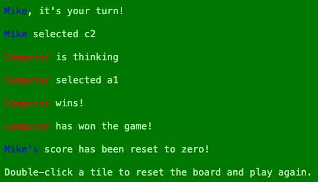

# ci_pp2

Notes for later -

Jest Parameterised tests are super cool - pass it an array of options and it will test all of them. My function takes more than one parameter, so they must be passed in as an arrays themselves.

Decided to try to be lazy and get ChatGPT to generate the parameters for some of the tests

prevent text selection when clicking tiles https://www.w3schools.com/howto/howto_css_disable_text_selection.asp

wewlcome function uses a .one function found here: https://api.jquery.com/one/