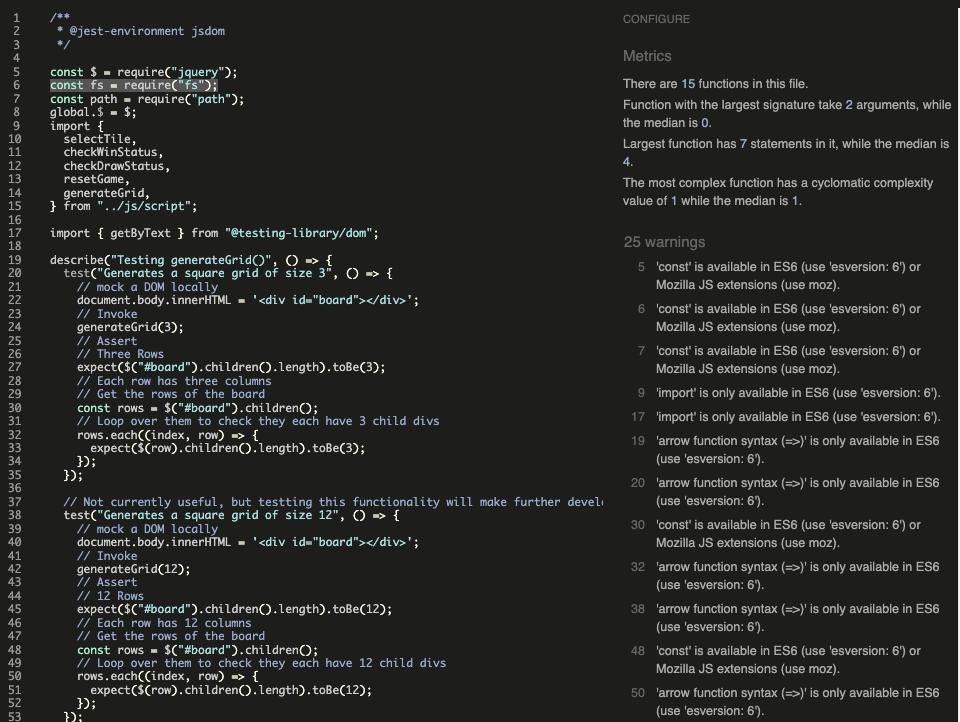

# TicTacToe Milestone Project 2
This project is a recreation of the classic game TicTacToe, as part of my Level 5 Diploma in Web Application Development. 

TicTacToe, also known as Noughts and Crosses, or Xs and Os, is a game where users take turns to mark spaces on a 3-by-3 grid, either with an X or and O.

## Contents
- [About TicTacToe](#TicTacToe-Milestone-Project-2)
- [User Stories](#user-stories)
  - [As a user...](#as-a-user)
- [Design Considerations](#design-considerations)
  - [Creating a wireframe](#creating-a-wireframe)
  - [Once building was underway](#once-building-was-underway)
- [Code Sources](#code-sources)
  
- [Features](#features)
- [Lighthouse Reports & Validation](#lighthouse-reports--validation)
- [Testing](#testing)
- [Deployment](#deployment)
- [Credits](#credits)
- [Future Developments](#Future-Developments)

## User Stories
### As a user...
* I must understand the purpose of the page at load
* I would like to be able to play TicTacToe against a computer opponent
* I must understand the controls
* I would like to record a score
* I would like to see my current score
* I would like to see a top score to try to beat it

## Design Considerations
### Creating a wireframe
* This site must be accessible on desktop and mobile devices such as phones or tablets. Various sources forecast the mobile gaming industry to generate around $100-Billion* in 2025, so cross-device design from the start has been essential.

\* [Source1](https://venturebeat.com/games/mobile-gaming-is-expected-to-generate-98-7-billion-in-revenue-globally-xsolla/#:~:text=Mobile%20gaming%20is%20expected%20to%20generate%20%2498.7%20billion%20in%20revenue%20globally%20%7C%20Xsolla,-Dean%20Takahashi%40deantak&text=Xsolla%20has%20a%20new%20State%20of%20Play%20report%20for%20Autumn%202024.&text=Image%20Credit%3A%20Xsolla-,Mobile%20gaming%20is%20expected%20to%20generate%20%2498.7%20billion%20in%20revenue,the%20market%20at%20%2465%20billion.) [Source2](https://www.statista.com/outlook/amo/media/games/mobile-games/worldwide?currency=usd) [Source3](https://www.verdict.co.uk/in-data-mobile-gaming-will-generate-195bn-in-revenue-by-2030/?cf-view)

* Perhaps in contrast the the previous statement of modernity, I opted to go with a decidedly retro-feel, aiming to imitate very early personal computers, such as a [TRS-80 Model 4](https://www.classic-computers.org.nz/blog/2013-04-06-replacing-model4-screen.htm)
 with their green-monochrome colourscheme. 

 

* Using Balsamiq, I mocked up some wireframes showing a fairly simple, static design - the branding comes in the form of a Logo or Title of sorts, stretched accross the grid of tiles. Any information or instructions are conveyed to the user via the "console" or terminal, in keeping with the retro, pre-GUI operating system style.

### Once building was underway

## Code Sources

## Features

## Lighthouse Reports & Validation
### Performance

### Accessibility

### Code Validation

## Testing
### Testing User Stories

### Additional testing

### Functional Testing

### Browser Compatibility

## Deployment
This site has been deployed to Github Pages. The steps to deploy are as follows:
  - In the Github repository, navigate to the Settings tab
  - In the menu of the left under "Code and automation" visit "Pages"
  - From the source section drop-down menu, select the Master Branch
  - Once the master branch has been selected, the page will be automatically refreshed with a detailed ribbon display to indicate the successful deployment.

## Cloning this repo

## Forking this repo

## Credits

## Future Developments
Key listener to user 1-9 number keys to select tile
Local multiplayer

# Notes for later -

Jest Parameterised tests are super cool - pass it an array of options and it will test all of them. My function takes more than one parameter, so they must be passed in as an arrays themselves.

Decided to try to be lazy and get ChatGPT to generate the parameters for some of the tests

prevent text selection when clicking tiles https://www.w3schools.com/howto/howto_css_disable_text_selection.asp

wewlcome function uses a .one function found here: https://api.jquery.com/one/

https://travishorn.com/delaying-foreach-iterations-2ebd4b29ad30 came in super useful

Custom Scrollbar https://www.w3schools.com/howto/tryit.asp?filename=tryhow_css_custom_scrollbar