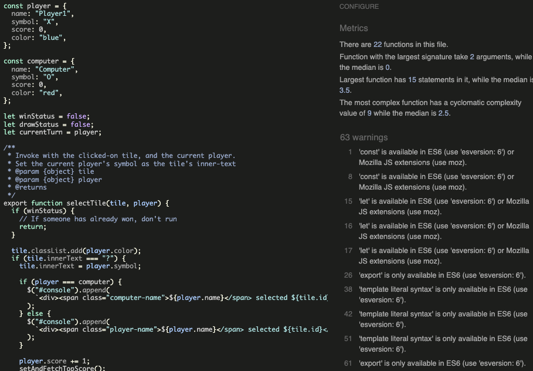

# TicTacToe Milestone Project 2
This project is a recreation of the classic game TicTacToe, as part of my Level 5 Diploma in Web Application Development. 

TicTacToe, also known as Noughts and Crosses, or Xs and Os, is a game where users take turns to mark spaces on a 3-by-3 grid, either with an X or and O.

## Contents
- [About TicTacToe](#TicTacToe-Milestone-Project-2)
- [User Stories](#user-stories)
  - [As a user...](#as-a-user)
- [Design Considerations](#design-considerations)
  - [Creating a wireframe](#creating-a-wireframe)
  - [Once building was underway](#once-building-was-underway)
- [Code Sources](#code-sources)
  
- [Features](#features)
- [Lighthouse Reports & Validation](#lighthouse-reports--validation)
- [Testing](#testing)
- [Deployment](#deployment)
- [Credits](#credits)
- [Future Developments](#Future-Developments)

## User Stories
### As a user...
* I must understand the purpose of the page at load
* I would like to be able to play TicTacToe against a computer opponent
* I must understand the controls
* I would like to record a score
* I would like to see my current score
* I would like to see a top score to try to beat it

## Design Considerations
### Creating a wireframe
* This site must be accessible on desktop and mobile devices such as phones or tablets. Various sources forecast the mobile gaming industry to generate around $100-Billion* in 2025, so cross-device design from the start has been essential. [Source1](https://venturebeat.com/games/mobile-gaming-is-expected-to-generate-98-7-billion-in-revenue-globally-xsolla/#:~:text=Mobile%20gaming%20is%20expected%20to%20generate%20%2498.7%20billion%20in%20revenue%20globally%20%7C%20Xsolla,-Dean%20Takahashi%40deantak&text=Xsolla%20has%20a%20new%20State%20of%20Play%20report%20for%20Autumn%202024.&text=Image%20Credit%3A%20Xsolla-,Mobile%20gaming%20is%20expected%20to%20generate%20%2498.7%20billion%20in%20revenue,the%20market%20at%20%2465%20billion.) [Source2](https://www.statista.com/outlook/amo/media/games/mobile-games/worldwide?currency=usd) [Source3](https://www.verdict.co.uk/in-data-mobile-gaming-will-generate-195bn-in-revenue-by-2030/?cf-view)

* Perhaps in contrast the the previous statement of modernity, I opted to go with a decidedly retro-feel, aiming to imitate very early personal computers, such as a [TRS-80 Model 4](https://www.classic-computers.org.nz/blog/2013-04-06-replacing-model4-screen.htm)
 with their green-monochrome colourscheme. 

 

* Using Balsamiq, I mocked up some wireframes showing a fairly simple, static design - the branding comes in the form of a Logo or Title of sorts, stretched accross the grid of tiles. Any information or instructions are conveyed to the user via the "console" or terminal, in keeping with the retro, pre-GUI operating system style.


### Once building was underway

## Code Sources
A colleague of mine reccomended Jest's parameterised testing - simply pass an array of possible arguments to a single test, and it will test each one accordingly. This [blog-post](https://blog.codeleak.pl/2021/12/parameterized-tests-with-jest.html) was a fantastic stepping-stone in getting started.

I did try to ask ChatGPT to generate some test-values for me. This felt like a perfect use for generative AI - I explained the task very clearly, hoping simply that it would return all possible combinations of Xs and Os where a draw would be possible



However ChatGPT would do everything possible to weasle out of actually giving me the list.


_UncooperativeGPT_. When discussing this with a friend he suggested that _Prompt Engineering_ was simply fiding the right combination of "pretty" and "please". 

The whole game revolves around clicking on "Tiles" that are essentially just pieces of text. Through testing itt became apparent that it was very easy on desktop to accidentally select the text. This can be prevented with some simple CSS that I found [here](https://www.w3schools.com/howto/howto_css_disable_text_selection.asp) 

As part of the welcome, I wanted messages to appear in the console, slightly delayed. I hadn't realised there were more arguments allowed in the .forEach loop, but [this code](https://travishorn.com/delaying-foreach-iterations-2ebd4b29ad30) makes greate use of the index-parameter to do roughly same as me - loop over the array, logging out each element a specified time after the previous element.

Initially, I had hoped that each loop in the function would take a second to run, however the setTimeout() does not work like this. Instead, thanks to the post linked above, I realised that I needed to multiply the timeout by the index in order to have them log out at the desired, steady pace.


## Features

## Lighthouse Reports & Validation
### Performance
My Code Institute assigned Mentor suggested that I should experiment with using JS to manipulate the DOM more, so I opted to generate the 3x3 grid of tiles programatically, instead of with pre-written HTML. One advantage of that ties in with an additional feature I hope to implement in the future which would let users choose the size of the grid that they play on. The downside to this, however, is that the "Cumulative Layout Shift" stat in Performance takes a huge hit, dropping the overall performace score to 84.


Switching to hand-typed HTML with no DOM manipulation immediately remedies this issue and brings the Performace score up to 99, with a Cumulative Layout Shift of 0.011


### Accessibility
Though the initial lighthouse tests returned Accessibility at 100, it occured to me to add a note to anyone using a screen reader about how to identify tiles as a grid reference, similar to a chessboard. I also added in the aria label and tab index to each div. 
```JS
<div id="${tileId}" class="tile" aria-label="${tileId}" tabindex="0">?</div>
```


I also ran the project through WAVE (Web Accessibility Evaluation Tool) multiple times to find, correct, and verify the correct levels of contrast are used.


The "Alert" shown in the image is because no page regions have been used. The elements in question are much more applicable to blogs or news websites where "navigation", "main" or "aside" would make sense to use. These elements are discussed in the [W3C Web Accessibility Initiative](https://www.w3.org/WAI/tutorials/page-structure/regions/)

### Code Validation
I've passed my HTML into the validator at [w3.org](https://validator.w3.org/nu/?doc=https%3A%2F%2Fmikesealey.github.io%2Fci_pp2) and recieved no warnings or errors.


## Testing
### Testing User Stories

### Additional testing

### Functional Testing


### Browser Compatibility

## Deployment
This site has been deployed to Github Pages. The steps to deploy are as follows:
  - In the Github repository, navigate to the Settings tab
  - In the menu of the left under "Code and automation" visit "Pages"
  - From the source section drop-down menu, select the Master Branch
  - Once the master branch has been selected, the page will be automatically refreshed with a detailed ribbon display to indicate the successful deployment.

## Cloning this repo

## Forking this repo

## Credits

## Future Developments
Key listener to user 1-9 number keys to select tile
Local multiplayer
Global High Scores with GSHeets API


# Notes for later -
Custom Scrollbar https://www.w3schools.com/howto/tryit.asp?filename=tryhow_css_custom_scrollbar